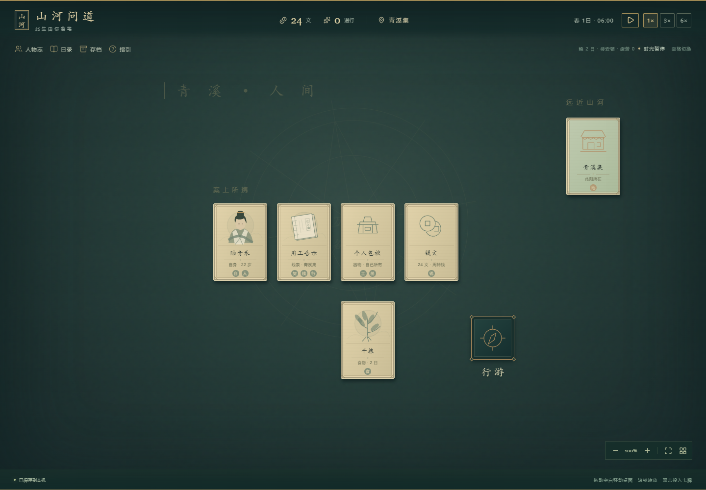

# 山河问道 · 凡尘篇（v0.3）

根据 `docs/凡尘篇/00_阅读入口与设计边界.md` 接入的新档可玩版本。独自抵达青溪，从谋生、作品与交往中寻找可靠修法，完成首次修持和实际应用。



## 运行

双击 **启动游戏.cmd**，在浏览器打开 **http://127.0.0.1:5173**。已包含生产构建 `dist/`，只需 Node.js 22.12 或更新版本。如该端口已有本游戏服务，刷新即可。

```powershell
npm start
```

浏览器存档按地址隔离。新档进入凡尘篇；旧档保留原型玩法、人物与财物。想以独自开局体验新内容，先在存档页导出旧旅程，再选择「开启新旅程」。不要直接双击 dist/index.html。

## 第一次游玩

1. 从「落笔」写下姓名，再通过「忆起」选择出身物件、「自省」选择天赋，最后启程。创角中途刷新可继续，默认不认识地方人物。
2. 桌面上打开「行游」，将自身与「用工告示」投入槽位，开始行事。
3. 等待计时或点击「等候下一进展」，打开完成的行动，手动「收取成果」。新的线索回到桌面。
4. 同一张卡可以有不同用法：「今夜的住处」投入交游可付费落脚，投入谋生可用劳动换食宿；「谨慎的打算」可作为补充改变部分做法。
5. 自身与地点投入行游即可出发。去药铺、作坊、听雨亭或书院寻找新的线索，完成一项凡人成果；完成的作品可以投入谋生承接专业委托。
6. 在书院核验修法来源，去旧观完成准备。研习方法卡可选择方法并理解；修养方法卡可试行；加注本纠错，加目标地点进行实际应用。

新档起初只认识青溪集和「行游」。行动完成后，交谈、谋生、修养及更深的操作和地点由具体经历逐步引出；发现会保存，离开地点不会丢失。更新前的旧档保留已有入口。

自由拖动卡牌、动词和窗口，拖动空白平移，滚轮缩放。也可点击槽位再点击卡牌，或双击投入。空格暂停/继续；后台暂停且不补离线时间。关闭或切换未开始的行动时，卡牌退回原位；进行中和待收取的卡牌在「卡牌去向」栏显示，点击可直接定位。未收取的成果会随存档保留。已租房后，将自身与铺位投入修养即可自动计入返程并歇息，不必另开行游。食宿说明在「起居」，相识与通信在「人物志」。

## 当前边界

十地点、四生计、十条压缩事件链、三求道渠道、三方法，带人物身份、生命周期、关系事实、通信、物品所有权、合同账本、存档迁移。24 条短事件目前为轻量选择分支；完整天气/借物/债务/监护事件、全部 AC01—AC30 独立配方和 4—6 小时真人平衡验收尚未完成。

详细实现、已知差距和验证记录见 [凡尘篇实现记录](docs/凡尘篇/05_实现记录与验证.md)。旧档操作见 [旧版桌面操作说明](docs/旧版桌面操作说明.md)。

## 开发与检查

后续设计计划：[知识、情报与自由探索（v0.2）](docs/知识情报与自由探索_设计实施计划_v0.1.md)，覆盖炼丹、炼器和功法的固定知识、局内变化、传承与独立试验，并新增直接堆叠、自定义收藏、个人手札与一键准备计划。该计划尚未接入游戏。

```powershell
npm run dev
npm run build
npm run test:browser
npm run test:mortal-performance
```

`build` 包含类型、内容和领域测试。浏览器测试覆盖新篇章与旧档桌面；性能测量写入 `docs/凡尘篇/性能测量.json`，包含测试硬件与适用范围。
