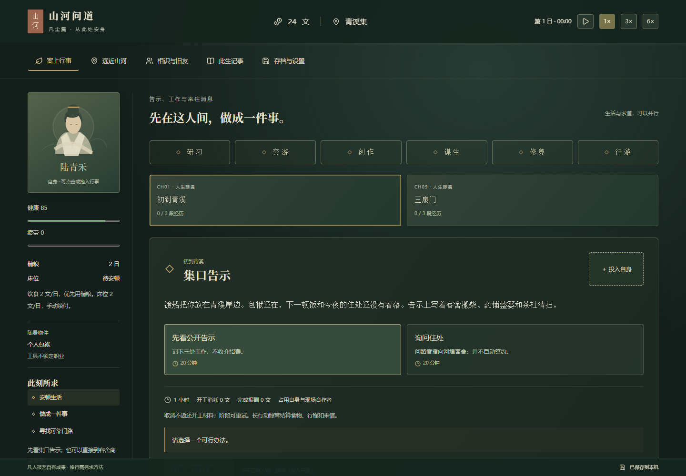

# 山河问道 · 凡尘篇（v0.3）

根据 `docs/凡尘篇/00_阅读入口与设计边界.md` 接入的新档可玩版本。独自抵达青溪，从谋生、作品与交往中寻找可靠修法，完成首次修持和实际应用。



## 运行

双击 **启动游戏.cmd**，在浏览器打开 **http://127.0.0.1:5173**。已包含生产构建 `dist/`，只需 Node.js 22.12 或更新版本。如该端口已有本游戏服务，刷新即可。

```powershell
npm start
```

浏览器存档按地址隔离。新档进入凡尘篇；旧档保留原型玩法、人物与财物。想以独自开局体验新内容，先在存档页导出旧旅程，再选择「开启新旅程」。不要直接双击 dist/index.html。

## 第一次游玩

1. 选择姓名、出身与天赋，默认不认识任何地方人物。
2. 在「集口告示」选择办法，点击或拖入自身，开始行事。
3. 点击「推进到下一项结果」。完成劳动才获得报酬，取消会结清占用。
4. 选择药铺、作坊、听雨亭或书院，完成一项凡人成果；续住、储粮、歇息都有明确入口。
5. 到书院选择「三扇门」并验证方法，再完成「第一缕」的准备。
6. 在方法区选择调息、观息或静观，完成理解、试行、纠错、复验和实际应用。可继续留在青溪生活。

空格暂停/继续；后台暂停且不补离线时间。点击与键盘可替代拖拽，大字与减弱动画偏好会保存。

## 当前边界

十地点、四生计、十条压缩事件链、三求道渠道、三方法，带人物身份、生命周期、关系事实、通信、物品所有权、合同账本、存档迁移。24 条短事件目前为轻量选择分支；完整天气/借物/债务/监护事件、完整自由多卡配方和 4—6 小时真人平衡验收尚未完成。

详细实现、已知差距和验证记录见 [凡尘篇实现记录](docs/凡尘篇/05_实现记录与验证.md)。旧档操作见 [旧版桌面操作说明](docs/旧版桌面操作说明.md)。

## 开发与检查

```powershell
npm run dev
npm run build
npm run test:browser
npm run test:mortal-performance
```

`build` 包含类型、内容和领域测试。浏览器测试覆盖新篇章与旧档桌面；性能测量写入 `docs/凡尘篇/性能测量.json`，包含测试硬件与适用范围。
