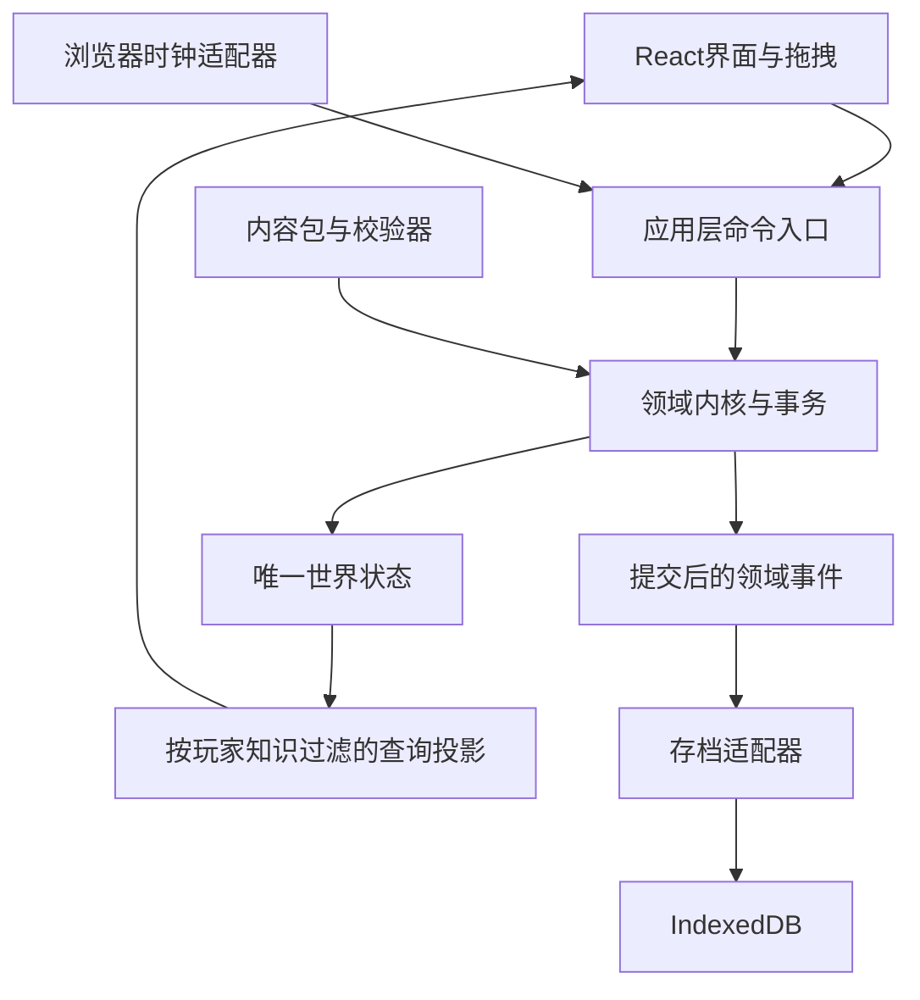

# 01｜架构与工程约定

基线：企划v0.3；技术文档v0.1。下列结构为网页首版建议。

## 1. 技术组成

| 层面 | 选择 | 职责 |
|---|---|---|
| 语言 | TypeScript，启用严格检查 | 规则、类型、界面与工具共用语言 |
| 界面 | React、HTML、CSS | 卡牌桌面、事件面板、人物与组织信息 |
| 开发与构建 | Vite | 本地开发、资源处理、静态构建 |
| 模拟内核 | 独立TypeScript模块 | 世界状态、命令、时间、资源和结算 |
| 内容 | 版本化JSON | 人物定义、职业、行动、事件、物品及数值表 |
| 存储 | IndexedDB | 存档快照、元数据和备份 |
| 验证 | Vitest、Playwright | 领域测试和浏览器流程测试 |

首版使用DOM卡牌。卡牌移动采用视觉层的位置和变换，规则只在提交组合时运行。先通过可见范围裁剪、列表虚拟化和局部订阅控制开销，再依据性能测试评估Canvas、WebGL或Web Worker，避免原型同时维护两套渲染方式。

## 2. 模块关系



依赖规则：`domain`不引用React、DOM、IndexedDB或浏览器定时器。基础规则可以在无浏览器环境执行。存储失败不能改写游戏结算；界面重挂载也不能重复启动行动。

不采用每张卡牌独立计时、组件内部维护人物副本、任意脚本直接修改世界的实现方式。

## 3. 建议工程结构

```text
src/
  domain/
    model/                 # 权威对象与值类型
    commands/              # 玩家、NPC与系统命令
    actions/               # 组合匹配、预留、行动状态机
    rules/                 # 职业、技艺、寿数、具体效果
    dao/                   # 仅两类道行判定
    events/                # 事件实例、事实、知情与选择
    organizations/         # 任命、委托、职责与预算
    scheduler/             # 游戏时间与到期队列
    random/                # 稳定判定键与确定性随机
    transactions/          # 变更验证、提交、结算凭据
    queries/               # 只读领域查询
  application/
    game-session.ts        # 单一写入入口与生命周期
    projections/           # 玩家可见模型
    ports/                 # 时钟、保存、随机等接口
  infrastructure/
    browser-clock/
    indexeddb/
    content-loader/
    random/
  presentation/
    board/                 # 卡牌、分区、拖拽和组合预览
    character/
    events/
    organization/
    save/
    shared/
  content/                 # 首版正式内容
tools/content-check/       # 构建前内容检查
tests/unit/
tests/scenarios/
tests/browser/
```

这些目录是工程职责划分，首个版本允许合并小文件，不要求空目录先行。

## 4. 唯一状态与查询

`WorldState`是游戏的唯一事实来源。界面维护的拖拽坐标、缩放、选中项和面板状态属于`UiState`，不能写入人物能力或资源数量。

React订阅经过缓存的只读投影。建议使用外部会话存储配合`useSyncExternalStore`；投影没有变化时返回同一引用。该API用于订阅React外部状态，其快照引用需要稳定，详见[React官方说明](https://react.dev/reference/react/useSyncExternalStore)。

普通组件状态用于表单和局部交互。组件渲染、effect重执行、拖拽预览均不得进行抽签、扣料或发奖。

`PlayerProjection`只包含玩家已知信息。未知NPC目标、证据来源和预感内部判定值不通过普通卡牌面板暴露。开发调试面板另设开关；离线单机不以阻止开发者工具修改为目标。

## 5. 命令协议

```ts
type CommandEnvelope<T> = {
  commandId: string;
  expectedRevision: number;
  actorId: string | null;
  payload: T;
};

type CommandResult =
  | { ok: true; revision: number; domainEventIds: string[] }
  | { ok: false; code: string; messageKey: string; retryable: boolean };

interface GameSession {
  preview(input: StackInput): ActionPreview[];
  dispatch(command: CommandEnvelope<GameCommand>): CommandResult;
  advanceTo(targetTick: number): void;
  getProjection(): Readonly<PlayerProjection>;
  subscribe(listener: () => void): () => void;
}
```

`StackInput`携带真实对象ID及请求数量；不以显示文字或DOM节点识别物品。`preview`无副作用，不产生随机结果，也不保证稍后提交一定成功。

首版命令：`StartAction`、`CancelAction`、`ChooseEventOption`、`AdvanceProfession`、`AssignDelegate`、`SetPolicy`、`TransferItem`。暂停与速度由会话控制，保存与载入由应用层协调。

提交顺序：校验命令ID → 检查世界版本 → 重新校验业务条件与权限 → 构造变更草案 → 检查不变量 → 原子提交 → 发布领域事件 → 刷新投影与请求保存。

重复`commandId`返回先前结果；过期版本返回`STALE_REVISION`，界面重新预览。命令回执可以有限保留，过期回执对应的旧版本命令不能再次执行。职业晋升、事件选择等业务凭据另行长期保存。

错误码至少包括：`ACTOR_BUSY`、`WRONG_LOCATION`、`MISSING_REQUIREMENT`、`RESOURCE_RESERVED`、`EVENT_EXPIRED`、`PERMISSION_DENIED`、`ALREADY_SETTLED`、`CONTENT_INCOMPATIBLE`。

## 6. 桌面交互

主视图分为地点、可用卡牌、进行中行动、待处理事件和收纳区。长期属性通过人物面板查看。

拖拽仅调整视觉组合；松开后显示候选行动、参与者、已知条件、消耗与预计时间。需要开始按钮确认有成本的行动；允许用户设置明确的常用快捷操作，但不能让单纯整理卡牌消耗资源。

同一NPC的关系入口和现场人物入口都引用同一个实体。远方友人的卡牌可以用于写信、查看关系，直接交谈仍需检查地点。

补充点击选择卡牌和键盘导航，使操作不依赖精确拖拽。暂停按钮始终可达。重大事件先完成当前原子结算，再暂停并显示可选行动。

## 7. 浏览器生命周期

游戏分钟使用整数tick。浏览器帧和现实毫秒只用于决定本次请求推进到哪里，不直接决定炼丹、修炼等结果。

默认规则：隐藏页面时暂停并请求保存；恢复可见时保留暂停状态，由玩家继续。后台计时和刷新可能受浏览器节流影响，因此不能用`setTimeout`是否准时触发判断世界结果。[MDN说明](https://developer.mozilla.org/en-US/docs/Web/API/Page_Visibility_API)

突发长帧按计算预算分批推进，先处理所有到期事项，不跳过结果。后台停留和关闭网页的现实时间不加入进度。

暂停原因使用集合：`user`、`hidden`、`event`、`save_error`、`read_only`。清除一个原因不能解除其他原因造成的暂停。

## 8. 工程边界

首版不使用服务端游戏数据库，不引入登录、SSR、微服务、联机同步和运行时生成剧情服务。未来云存档可通过`SaveRepository`扩展，不能让UI直接依赖远端存储。

所有第三方依赖在建项时锁定版本；静态资源与内容包都有版本标记。构建失败不能通过跳过类型检查或内容校验掩盖。

测试工具依据：[Vitest官方入门](https://vitest.dev/guide/)、[Playwright官方入门](https://playwright.dev/docs/intro)。实际测试命令与配置随工程创建提交。
