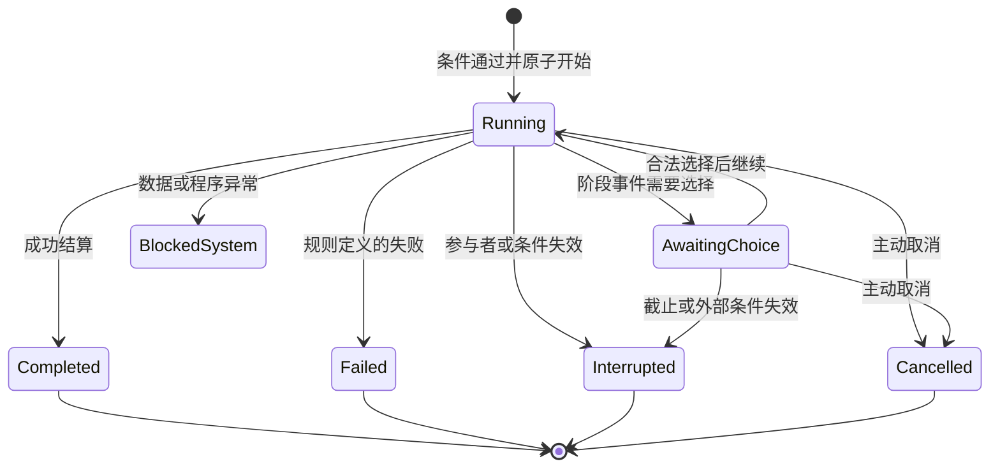

# 03｜核心规则与结算

基线：企划v0.3；技术文档v0.1。概率曲线、时间单位和异常策略为当前实现建议，数值需经试玩调整。

## 1. 堆叠匹配

一次拖拽输入是一组实体引用与数量。匹配器先依据卡牌类型与标签筛选行动，再尝试绑定命名槽位，例如`actor`、`teacher`、`instrument`、`score`。

默认按集合匹配，桌面上下顺序不决定谁是施术者。多个绑定都合理时让玩家选择，并明确展示实际参与者。不同人物槽位默认要求不同实体，除非行动定义明确允许复用。

输入步骤：

1. 解析显示卡到真实对象，去除重复引用，合并请求数量。
2. 查找候选行动，校验必需槽、可选槽、数量和标签。
3. 检查已知条件并生成预览；未知条件只显示适当的不确定描述。
4. 玩家选择并开始后，在当前世界版本上重新校验全部真实条件。
5. 同时取得人物、设施、工具和材料的占用，任何一项失败则全部不提交。

MVP不允许一个对象被误用来同时满足两个互斥槽位，也不自动执行存在多个候选的组合。

## 2. 行动状态机



系统异常不是游戏内失败。`blocked_system`保留最后一致状态并暂停会话，生成诊断信息，不偷偷吞掉材料或发放部分奖励。修复后从一致存档恢复，首版不提供自动猜测式修复。

终局结算原子执行：重新校验阶段条件 → 确定结果 → 生成全部效果 → 校验变更 → 写入结果与唯一凭据 → 释放占用 → 发布后续事件。

若检查发现人物已经离开、失能或必要设施损坏，执行定义好的中断策略。不能忽略关键条件继续生产。

## 3. 消耗、预留与取消

| 资源类别 | 开始时 | 结束或中断时 |
|---|---|---|
| 行动人物 | 独占主要行动 | 释放占用 |
| 丹炉、工作位 | 预留所需容量 | 释放容量 |
| 琴、工具、物理书卷 | 预留使用权 | 归还并按规则结算损耗 |
| 开始即消耗的材料 | 预留后立即消费 | 默认不退款；具体配方可明确退款规则 |
| 完成时消耗的材料 | 保持数量预留 | 完成时消费；取消时释放 |
| 货币 | 按合同规定预付或预留 | 按结算结果付尾款或释放 |

每个行动必须指定取消与中断策略。界面从同一策略生成预览，不能另写一套显示规则。

首版单阶段行动默认在开始时取得全部必需资源。持续经营拆成多次有限生产周期，每轮重新获取供给；缺料暂停下一轮并上报，不虚构未购买材料。复杂多阶段配方后续在同一状态机上扩展。

角色虽被管理项目引用，也不能被另一个项目占用。普通工作完成后释放占用，委托定义本身不永久锁住全部成员。

## 4. 时间与调度

`currentTick`采用游戏分钟。到期事项保存在优先队列中，排序键为`(dueTick, phase, stableOrderId)`。显示刷新频率与模拟推进频率分开。

建议同tick顺序：

| phase | 内容 |
|---|---|
| 0 | 截止失效、失能等使条件不成立的已排定变化 |
| 10 | 行动阶段结束与项目结算 |
| 20 | 日历、供需与组织周期更新 |
| 30 | 基于已提交事实筛选后续事件、产生预感窗口 |
| 40 | 汇总玩家可见通知与暂停请求 |

时间有效区间统一为`[startTick, expiresTick)`。恰在截止tick完成的任务不算在期内，UI须明确预计完成是否越期。内容如需宽限应在实际截止时间中配置。

处理同一tick的事项时禁止插入玩家命令；全部处理完后再发布投影与暂停。队列处理生成的新事项只能进入本tick更晚阶段，或下一个tick，不能倒插已完成阶段。

零时长即时操作在命令事务内完成；排定项目的时长必须大于零。单tick的连锁事件设置处理上限，超出时进入诊断暂停，不丢弃剩余事件。

等待选择的项目按定义保留必要占用，世界是否继续推进由暂停原因决定。必须选择的重大事件暂停世界，常规邀约可留在待办中并继续流逝。

## 5. 成长、学习与寿数

职业晋升要求目标等级等于当前已获得等级加一。条件读取具体技能、知识、实践凭据、师承或职业自身前置；禁止读取总道行。成功后仅增加该职业一级，并执行此级明确列出的专业能力解锁。

道行为派生和，不发放“道行物品”或独立加点。普通练习增加相应技艺进展；理解与体悟使用有来源的具体记录。职业经验不默认全职业互通。

天资如何缩短练习时间、影响心得获得由领域规则定义，核心不提供“所有产出乘以天资”的通用公式。初版优先使条件满足的普通练习稳定获得进展，再为值得选择的风险增加检定。

健康、身体年龄和延年方法单独结算。某种调养方法能否减少损耗、某种丹药能否延年，由具体规则和同类使用记录决定；总道行不进入公式。

生理时间与历法时间分离：前者可以被明确方法改变速率，后者继续推进。年龄运算保存余数，避免大量小步推进和一次大步推进产生不同结果。完整寿终尚未定案，原型先通过有明确后果的健康与延年事件验证，不提前锁定永久死亡规则。

## 6. 道行访问边界

领域规则只能通过两个用途访问道行：

```ts
type DaoPurpose = 'special_effect_resistance' | 'omen_detection';
interface DaoResolver {
  probabilityForSpecialEffect(input: SpecialEffectContext): number;
  probabilityForOmen(input: OmenContext): number;
}
```

UI可以展示求和结果，但不能把该值回传为普通规则加成。一般条件语言没有`dao`、`totalLevel`或全职业求和操作；职业条件必须指定职业ID。一般效果语言没有`AddDao`。

构建检查限制：除道行模块、展示查询与验证工具外，不得引用道行求和函数。配置检查拒绝通过条件、公式或天赋表达式绕过限制。对允许的单职业前置仍需内容审查，避免人为拼出等价的总等级门槛。

## 7. 特殊效果生效概率

先满足物品使用条件、目标有效性、距离和媒介要求；存在明确免疫时直接按该能力处理。之后只对带`daoSpecialResistance`标签的效果调用道行判定。

建议示例公式，全部概率使用ppm：

```text
P = floorPpm + floor((basePpm - floorPpm) * strength / (strength + D))
```

约束：`0 <= floorPpm <= basePpm <= 1,000,000`，`strength > 0`，`D >= 0`。`basePpm`来自道具及准备，`strength`是此效果抵抗道行影响的尺度。操作者的道行不默认计入威力。

示例参数：基础80%、下限2%、强度20。

| 目标道行D | 特殊效果生效概率 |
|---|---|
| 0 | 80% |
| 20 | 41% |
| 60 | 21.5% |
| 180 | 9.8% |

这是平衡用示例，没有预设游戏里多少道行为常态。更高强度的道具可保持更高生效概率。明确免疫、完全不满足条件等情况在公式前处理，概率下限不能覆盖它们。

法器效果按稳定ID分别结算：物理伤害走普通战斗；摄魂走本判定；正常治疗走治疗规则。抵抗成功只使对应特殊效果不成立，不自动减少实体伤害，也不附送反伤、缩短持续时间或解除既有诅咒。

## 8. 趋吉避凶

先有真实的机会或威胁实例，再检查人物是否处于该情境的接触范围。只有符合条件的情境才可能触发预感，不在所有行动结束后普遍抽幸运奖励。

建议示例公式：

```text
P = basePpm + floor((capPpm - basePpm) * D / (scale + D))
```

约束：`0 <= basePpm <= capPpm < 1,000,000`，`scale > 0`。示例基础10%、上限70%、尺度20时，D为0、20、60、180对应10%、40%、55%、64%。趋吉和避凶可有不同基础参数，但都归入第二种作用。

成功时生成有限信息，如“此行令人不安”或“此处似有值得一访的人”；必须关联实际的调查、改道、交谈等可行动入口。失败不证明安全，也不能给出“没有危险”的确定结论。

预感不能揭示未获知的全套事件条件，不能自动提高炼丹、交易、延寿或普通命中率。相关专业与主动调查即使在低道行时也应有用。

## 9. 确定性随机与判定次数

设计使用可替换的确定性随机适配器。给定世界种子、随机算法版本和语义键，输出固定结果；领域代码不直接调用`Math.random()`或按UI帧数推进随机序列。

建议`keyed-v1`键格式为固定顺序的JSON字符串数组，使用UTF-8编码：

```text
[worldId, randomVersion, purpose, occurrenceId, subjectId, effectId, attemptIndex]
```

首版适配器建议使用固定版本的同步SHA-256实现，将世界种子和上述键共同作为输入。取确定的32位片段；通过拒绝采样转为0—999,999的整数，避免直接取模产生偏差。库版本、字节顺序、重试计数编码和已知测试向量在M0一起锁定，不能随浏览器或库升级变化。

一次检定成功条件是`sampledPpm < probabilityPpm`。抽样值、当时概率、结果与输入摘要一起保存；规则升级不得重新计算旧结果。

预感使用真实事件发生ID与明确的实质修订号。UI动作、命令序号或全世界revision不能用作预感发生ID。事件重复生成也须使用稳定业务键，防止靠取消行程和重建同一行程获得新签。

特殊道具的每次合法施放可有新attemptIndex，但必须先通过费用和使用限制；失败尝试同样消耗规定资源。混合效果使用各自effectId，增加一个摄魂效果不会改变已经存在的物理命中抽样。

读入相同旧存档并对相同未变化情境作相同行动，应获得相同结果。不同选择真正改变事实后允许出现不同结果；本设计不试图阻止玩家探索不同人生选择。

## 10. 事件与关系处理

事件由已提交事实、人物目标与时间触发。流程为：候选筛选 → 绑定真实人物 → 排除冷却和已结算实例 → 确定候选 → 建立EventInstance → 生成玩家可见信息。

每个机会有稳定发生ID、期限、参与者与选择。提交选项时重新检查有效期、资源、关系与权限；选项结果一次性原子应用。重复点击返回原结算，不重新抽结果或发奖。

事件模板不得通过“如果角色是正道”直接获知秘密恶行。事实先形成目击、痕迹或消息，再更新相关人物知识，最后根据立场和关系生成行动。

音乐和儒学事件可以以完成作品、形成分歧、维持友谊或解决疑难结束。事件奖励结构支持无金钱、无属性、无战斗成果的合法结果。

## 11. 组织委托与市场

每个委托周期由负责人在权限范围内生成普通行动命令，使用同一占用和结算系统。代理不具有绕过主要行动限制的权限。

每轮检查成员意愿、人物可用、设施维护、材料、预算与需求。缺少条件时记录阻塞原因并按上报规则生成一个异常事件，避免每个tick重复刷屏。

预算是组织账户上的明确授权额度，实际购买仍走库存与货币事务。市场必须有供货与购买需求；演出、教学与制药收入来自委托或可解释的市场规则，不无限凭空印钱。

任职改变权限与任务，不自动改变职业等级。成员离开、职位撤销和制度变化会使相关委托重新校验；已经开始的项目按其合同与中断策略处理。

## 12. 战斗接口与完整性

战斗作为一种分阶段行动接入，不拥有独立的人物副本。人物占用、装备消耗、伤势和逃离结果使用同一世界状态。

普通战斗只读取明确的武学、身体、装备、状态与环境。特殊效果通过第7节接入。战斗之外的成功条件也拥有完整任务结算路径，不默认等待某个最终战斗完成才发放学问或生活成果。
